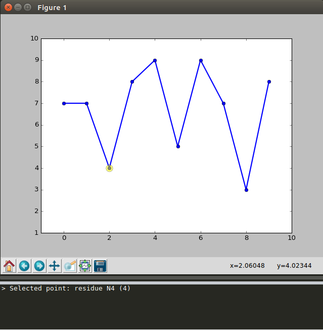

# MISC
Miscellaneous scripts that make life easier

## 0-dssp.py

Draw protein secondary structure legend on X axis as is shown in the figure:

## 1-data-picker.py

Print the **x and y coordinates** of a selected point, or the **residue**(name+index) **and property** of that residue if a **FASTA file** and **offset** are specified, for example:

## 2-retrive-viewpoint.py
For macromolecules with irregular shapes without proper alignment with respect to principal axis (X, Y or Z), it will be easier to use manually determined view perspectives. To re-use this view point, it is handy to save the matrix.

## 3-pubfig.py
Publication quality asthetics setup for scientific data visualization as shown below.

## 4-qatdcd.cpp
Similar as CatDCD (https://www.ks.uiuc.edu/Development/MDTools/catdcd/) but CHARMM compatible

## 5-nfile.cpp
Edit the `NFILE` entry of dcd header such that it corresponds to the actual frames of that trajectory file. Useful when dealing with CHARMM AFM simulations.
*Currently still under debugging*.