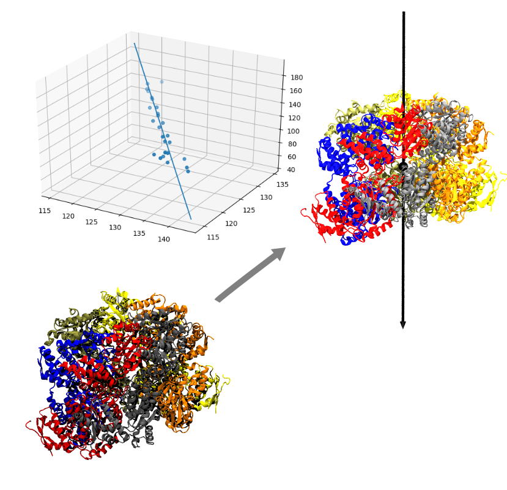
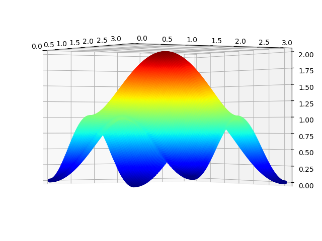
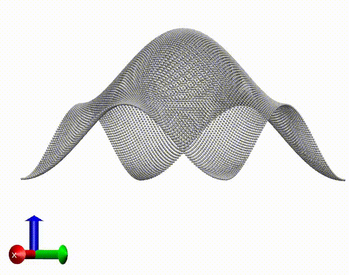

# MISC
Miscellaneous scripts that make life easier

### Table of contents
 1. [Draw protein secondary structure legend](#01)
 2. [Inspect a data point on matplotlib figure](#02)
 3. [Retrive the view angle setup of VMD](#03)
 4. [Publication quality figure setup for matplotlib](#04)
 5. [Concatenate CHARMM dcd files](#05)
 6. [Correct the NFILE information of a broken DCD file](#06)
 7. [Overlap GIF animations for better data representation](#07)
 8. [Rotate a macromolecule with N-fold symmetry and calculate the averaged structure](#08)
 9. [Calculate and plot the medial axis of polygon](#09)
10. [Calculate root mean square fluctuations of a DCD trajectory](#10)
11. [Process binary DCD files with Python](#11)
12. [Recenter and reorient a macromolecule with a threading channel](#12)
13. [Find missing residue segments of original PDB files](#13)
14. [Visualize and interact with 3D data in VMD](#14)

## [01-dssp.py](https://github.com/qi-wang-uc/misc/blob/master/scripts/01-dssp.py)<a name="01"></a>

Draw protein secondary structure legend on X axis as is shown in the figure:


The asthetics are set by `3-pubfig.py`.

## [02-data-picker.py](https://github.com/qi-wang-uc/misc/blob/master/scripts/02-data-picker.py)<a name="02"></a>

Print the **x and y coordinates** of a selected point, or the **residue**(name+index) **and property** of that residue if a **FASTA file** and **offset** are specified, for example:


## [03-retrive-viewpoint.py](https://github.com/qi-wang-uc/misc/blob/master/scripts/03-retrive-viewpoint.py)<a name="03"></a>
For macromolecules with irregular shapes without proper alignment with respect to principal axis (X, Y or Z), it will be easier to use manually determined view perspectives. To re-use this view point, it is handy to save the matrix.

## [04-pubfig.py](https://github.com/qi-wang-uc/misc/blob/master/scripts/04-pubfig.py)<a name="04"></a>
Publication quality asthetics setup for scientific data visualization as shown below.


- Possible error: matplotlib - Font family [u'sans-serif'] not found

- Solution:
1. `sudo apt-get install msttcorefonts -qq`
2. Then delete the content of `.cache/matplotlib`

## [05-qatdcd.cpp](https://github.com/qi-wang-uc/misc/blob/master/scripts/05-qatdcd.cpp)<a name="05"></a>
Similar as CatDCD (https://www.ks.uiuc.edu/Development/MDTools/catdcd/) but CHARMM compatible

## [06-nfile.cpp](https://github.com/qi-wang-uc/misc/blob/master/scripts/06-nfile.cpp)<a name="06"></a>
Edit the `NFILE` entry of dcd header such that it corresponds to the actual frames of that trajectory file. Useful when dealing with CHARMM AFM simulations.

## [07-overlay.py](https://github.com/qi-wang-uc/misc/blob/master/scripts/07-overlay.py)<a name="07"></a>
Overlay foreground and background images for fancy result visualization. Note that RGB codes for white color rendered by VMD is not always `255, 255, 255` (sometimes `254, 254, 254`). Thus tools like `gpick` is helpful to determine the actualy color codes to setup transparency pixels in the foreground images.


## [08-symm-avrg.py](https://github.com/qi-wang-uc/misc/blob/master/scripts/08-symm-avrg.py)<a name="08"></a>
Calculate symmetrical average coordinate after rotation along an axis.

- Input structure before averaging:


- Averaged structure after 7 rotations:


## [09-medial-axis.cpp](https://github.com/qi-wang-uc/misc/blob/master/scripts/09-medial-axis.cpp)<a name="09"></a>
Voronoi tessellation of polygon defined by connecting atoms of interest encompassing the pore of molecular machines.

input demo:<br>
```
51.737  29.350
46.354  26.340
47.869  21.474
52.073  16.979
57.530  19.933
55.936  24.811
```
## [09-plot-medial.py](https://github.com/qi-wang-uc/misc/blob/master/scripts/09-plot-medial.py)
Draw the tessellated polygon with the largest inscribed circle as shown below:


## [10-calc-rmsf](https://github.com/qi-wang-uc/misc/blob/master/scripts/10-calc-rmsf.cpp)<a name="10"></a>
Calculate root mean square fluctuations (RMSF).
Usage: 
1. Compile with `g++ calc-rmsf.cpp -o calc-rmsf`
2. Run with `./calc-rmsf ${mode} ${psfname} ${dcdname} ${outname}`

Currently implemented values for `mode` are `-1` (debugging with all atoms), `0` (CA atoms) and `1` (heavy atoms).

## [11-read-traj.py](https://github.com/qi-wang-uc/misc/blob/master/scripts/11-read-traj.py)<a name="11"></a>
Processing DCD format molecular dynamics trajectories with Python.

## [12-orient-channel.py](https://github.com/qi-wang-uc/misc/blob/master/scripts/12-orient-channel.py)<a name="12"></a>
For a macromolecule machine with a channel, put its geometric center at `(0, 0, 0)` and rotate the system such that the channel vector is aligned with a certain principal axis in the Cartesian coordinate system.

The following demo uses Hsp104 (PDB:5VJH) as an example, where the channel is defined as the best fitted 3D line from the coordinates of the CA atoms of the substrate. The `channel.dat` has the following format:
```
137.456 120.919 80.596
136.939 121.250 84.346
135.002 123.114 87.020
...
121.993 129.784 156.530
```
and can be obtained by 
```
grep ' CA ' 5vjh.pdb | grep ' P ' | awk '{print $7, $8, $9}' > channel.dat
```

For a system without substrate present, channel residue atoms can also be used to find the channel vector. Below is the result of channel fitting and reorientation, where the origin `(0, 0, 0)` is shown as black bead and the arrow represents the Z axis.



## [13-misres-probe.py](https://github.com/qi-wang-uc/misc/blob/master/scripts/13-misres-probe.py)<a name="13"></a>
Probing missing residues in input RCSB PDB file.

Usage using eukaryotic chaperonin CCT as an example: 

```python misres-probe.py 4b2t.pdb```

Output:
```
       chain [A] (    2) to (  534)
-----------------------------------
missing residue: (  141) to (  142)
missing residue: (  182) to (  188)
missing residue: (  218) to (  219)
missing residue: (  244) to (  270)
missing residue: (  336) to (  341)
missing residue: (  475) to (  482)

       chain [B] (    9) to (  524)
-----------------------------------
missing residue: (   56) to (   57)
missing residue: (  150) to (  153)
missing residue: (  222) to (  222)
missing residue: (  247) to (  274)

...(omitted for simplicity)

       chain [z] ( 1004) to ( 1525)
-----------------------------------
missing residue: ( 1182) to ( 1184)
missing residue: ( 1214) to ( 1215)
missing residue: ( 1240) to ( 1266)
missing residue: ( 1279) to ( 1287)
```

## [14-viz-3d-vmd.py](https://github.com/qi-wang-uc/misc/blob/master/scripts/14-viz-3d-vmd.py)<a name="14"></a>
Visualizing 3D data in `matplotlib` can be slow due to lacking of hardware acceleration.
This script will convert the 3D data into a dummy coordinate file, then we can use VMD to visualize and interact
with the data points.

Usage:
1. Press `W` to enter picking mode to print out custom information (Cartesian coordinates will be printed in the example). The picked point will also be highlighted (color can be changed based on VMD color code).
2. Press `Q` to reset view.

Notes:
The output coordinate might need to be scaled to avoid automatic bond inferring by VMD. The labeled coordinate are not scaled back to keep consistent of the coordinate file.


