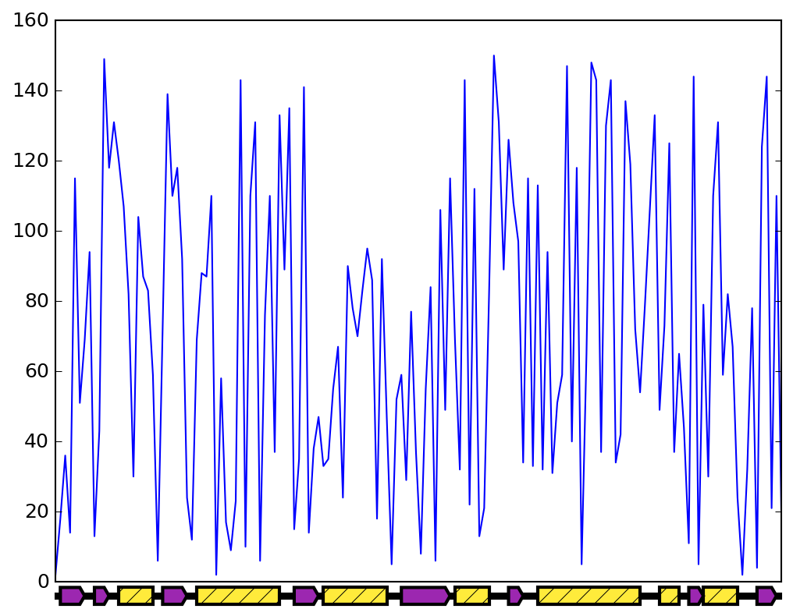

# misc
Miscellaneous scripts that make life easier

## draw_protein_ss.py

Draw protein secondary structure legend on X axis as is shown in the figure:


## pick_point.py

Print X and Y coordinates of a selected point like the following screenshot:
 

### Tips for Ubuntu users
```bash
mkdir -p "`python -m site --user-site`"
```

`cd` to that folder, `mkdir` new directory with a given module name and copy the .py file to that folder with a dummy `__init__.py` file to make it as a python package.
